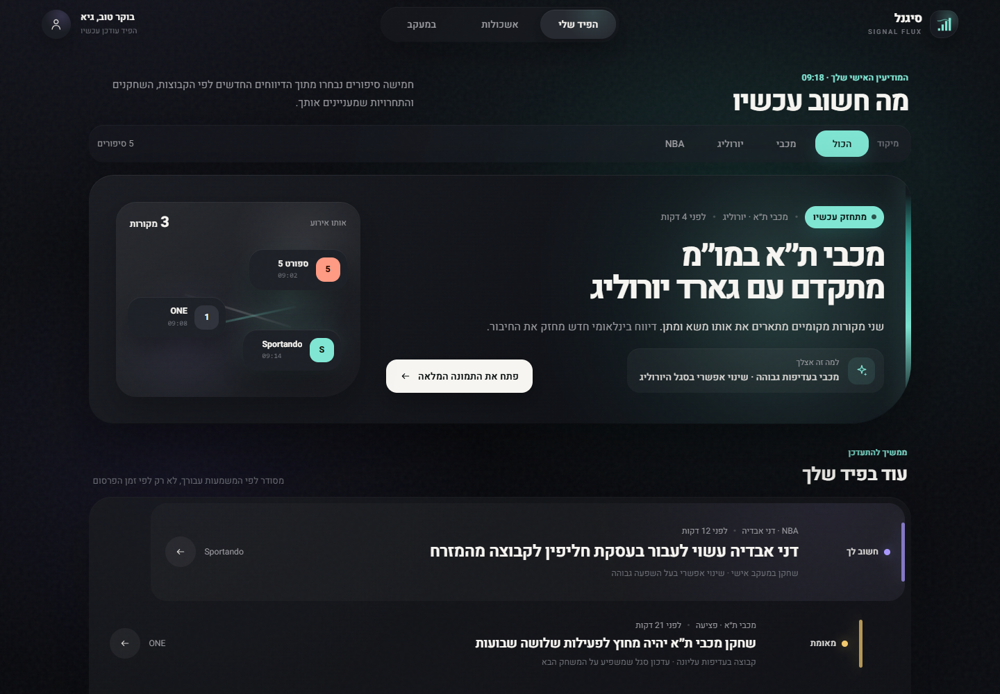
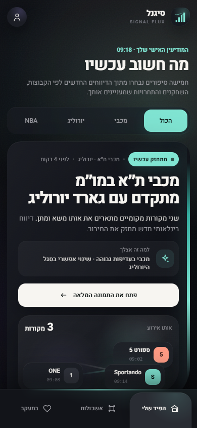
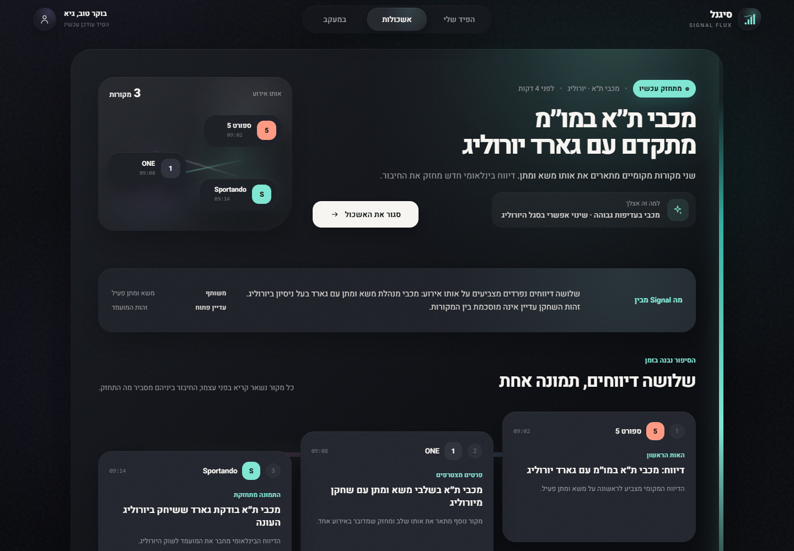
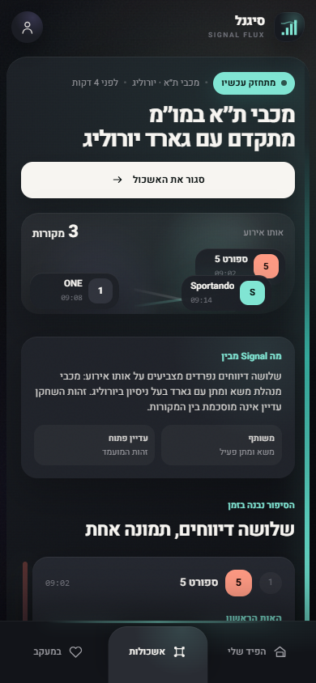
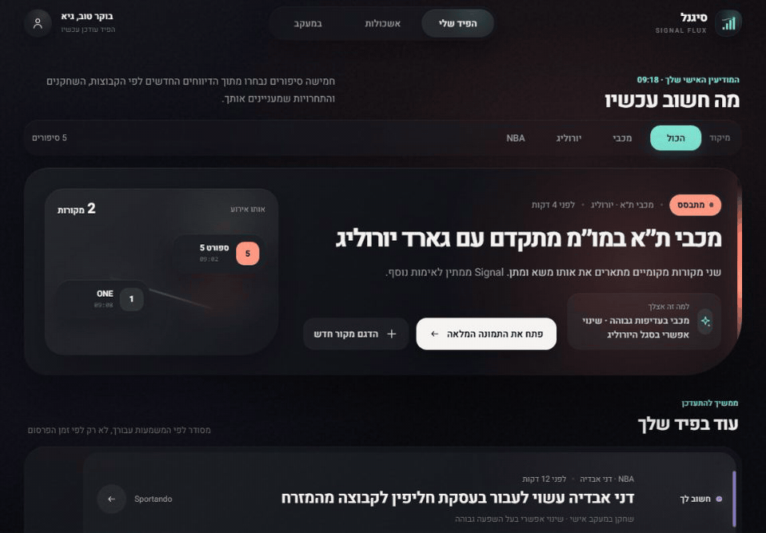
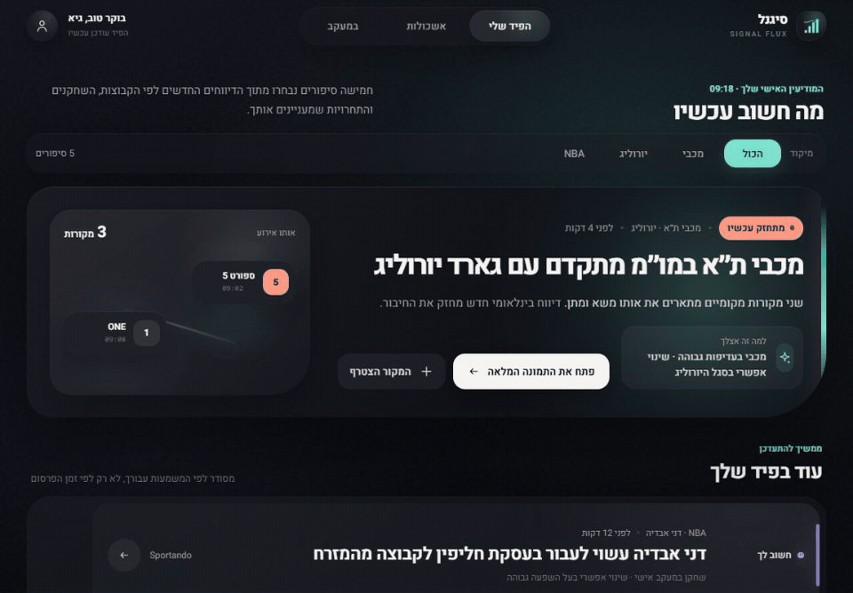
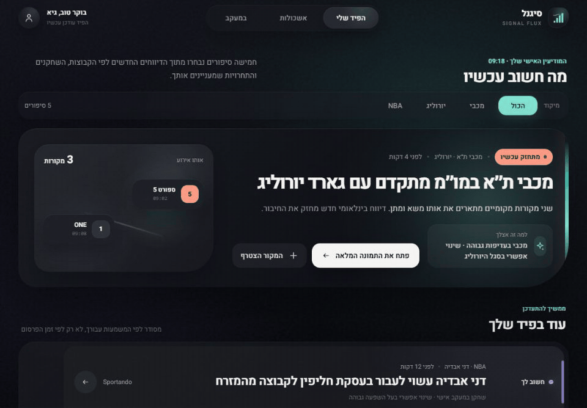

# Signal Flux

Signal Flux is a standalone, browser-rendered interaction concept for a
Hebrew-first Sports Intelligence OS. It is a convergence pass informed by the
feed clarity of Vector Trace, the clustered-source idea behind Orbit Field, and
the live evidence behavior demonstrated by Pulse Stream. Its visual language is
new: atmospheric graphite, broad opaque surfaces, localized story light, modern
Hebrew typography, and motion that appears only when product state changes.

This is concept exploration only. It is not a production implementation, does
not call the backend, does not register a production route, and is not intended
for merge yet. The [three earlier explorations](../../SPORTS_INTELLIGENCE_OS_CONCEPTS.md)
remain available as historical context.

## Review the prototype

From the repository root:

```powershell
npm --prefix frontend run dev
```

Open:

```text
http://127.0.0.1:5173/concepts/signal-flux/
```

The lead story provides the main interaction controls. Reviewers can:

- add the third source and watch the cluster state strengthen;
- expand the lead story into its source journey;
- change between `הכול`, `מכבי`, `יורוליג`, and `NBA`;
- use the desktop or mobile navigation to move between the personal feed,
  clusters, and followed subjects.

No live sports claims are made. The interface uses the repository's fixed Hebrew
fixtures and a documented concept time of 09:18.

## Static evidence

### Personalized feed





### Expanded source cluster





## Motion evidence

The GIFs are lightweight GitHub previews. Each linked WebM retains the
higher-quality real-browser recording.

### A third source joins the lead story



[Higher-quality source-arrival WebM](./signal-flux-source-arrival.webm)

### The lead story expands into its source journey



[Higher-quality cluster-transition WebM](./signal-flux-cluster-transition.webm)

### The feed changes from all stories to Maccabi



[Higher-quality filter-transition WebM](./signal-flux-filter-transition.webm)

## System rules

### Typography

- Heebo Variable is the primary family for Hebrew and interface text.
- Headlines use confident weight and tight optical spacing without becoming
  editorial poster headlines.
- Normal navigation, explanations, state labels, and metadata remain sans
  serif. Monospace is limited to source timestamps.
- Essential mobile text never depends on micro-labels.

### Color and atmosphere

- The foundation uses obsidian and graphite rather than flat black.
- Coral means an urgent or still-forming signal.
- Aqua means converging evidence or a newly strengthened cluster.
- Violet, amber, and blue distinguish quieter support-story states.
- The leading story alone changes the ambient light. Color is always paired
  with a written state.

### Surfaces and spacing

- The lead is one asymmetric living surface, not a dashboard grid.
- Supporting stories share a continuous stream surface and vary in rhythm,
  indentation, and emphasis instead of repeating one card template.
- Source reports are opaque, readable objects. Blur is limited to atmosphere
  behind content.
- Desktop uses a 1184px content measure. Mobile uses 14px page edges, 44px
  targets, and content-safe padding above the bottom edge ribbon.

### Iconography

- Icons are simple rounded strokes with direct semantic meaning.
- Source identities use compact marks plus names; position and color are never
  the only identifiers.
- Directional arrows are authored for RTL forward and back actions.

### Motion

- Source arrival uses one local signal, connector growth, source emergence,
  count/state replacement, and an atmospheric shift. The lead stays ranked
  first, so there is no unnecessary viewport jump.
- Cluster opening uses the browser View Transitions API to preserve the lead
  geometry while source reports emerge. A direct state change is the fallback.
- Filtering uses FLIP-style layout movement: leaving stories resolve first,
  retained stories spring into place, and newly relevant stories enter calmly.
- Desktop and mobile navigation share a moving active surface; cluster and
  followed-subject destinations also change the content state.
- Nothing loops while the product is at rest.
- `prefers-reduced-motion: reduce` removes spatial animation while preserving
  source count, qualitative state, filters, navigation, and expanded content.

## Evidence automation

With Chrome and FFmpeg available:

```powershell
npm --prefix frontend run capture:flux
```

The harness starts an isolated Vite server and real Chrome session, validates
exact DPR-1 viewports, Hebrew RTL, horizontal overflow, accessible control
names, mobile hit targets, and reduced-motion information parity. It captures
the PNGs from the Chrome compositor and records each running DOM interaction
through Chrome's compositor screencast stream before encoding the WebM and GIF
files.
